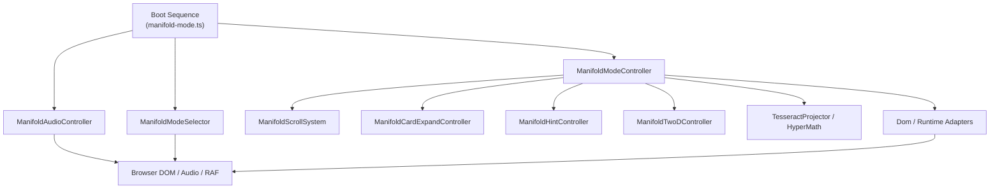

# Manifold

High-performance creative developer portfolio built with Astro 6 and Three.js. Features a custom "Manifold" architecture for multi-scene rendering, infinite logical scrolling, and WebGPU-ready pipeline.

## Technical foundation

The application is built on a modern, high-performance stack designed for smooth 3D experiences and fast delivery.

*   **Core**: Astro 6 (Static Site Generation / High-performance hydration)
*   **Graphics**: Three.js (WebGL/WebGPU ready architecture)
*   **Runtime**: Bun (Fast package management and execution)
*   **Motion**: Lenis (Smooth scroll synchronization)
*   **Math & Geometry**: Three-mesh-bvh for efficient spatial queries
*   **Testing**: Vitest and Lighthouse CI

## Internationalization (i18n)

The portfolio features a i18n implementation supporting two languages:
*   **English**: Primary interface for the international creative community.
*   **Polish**: Native language support for localized engagement.

### SEO-Driven routing
Instead of client-side translation switching, the project utilizes Astro's dynamic routing (`[locale].astro`). This approach ensures that:
*   **Indexability**: Each language has its own unique URL (e.g., `/en/` and `/pl/`), allowing search engines to index localized content separately.
*   **Performance**: Localized content is pre-rendered at build time, eliminating translation overhead in the browser.
*   **Reliability**: Proper `html lang` attributes and metadata are served per route, improving accessibility and SEO rankings.

## Getting started

Ensure you have Bun installed on your system.

```bash
bun install
bun dev
```

The application will be available at `http://localhost:4321`.

## Development scripts

*   `bun dev`: Start the local development server.
*   `bun build`: Generate a production-ready static build in the `dist/` directory.
*   `bun preview`: Preview the production build locally.
*   `bun optimize`: Run asset optimization scripts for .glb files (meshopt and KTX2).
*   `bun lint`: Perform TypeScript and Astro file linting.
*   `bun format`: Standardize code formatting across the project.
*   `bun test`: Execute the test suite using Vitest.

## System architecture

The project features a specialized architecture to handle multiple 3D scenes efficiently while maintaining a single WebGL context.

### Single-Canvas manager
Instead of creating multiple heavy WebGL contexts, a central `SceneManager` monitors `data-scene` slots in the DOM. It lazy-loads scene modules as they enter the viewport and renders them into the shared buffer using `setViewport()` and `setScissor()`.

### Manifold architecture
The "Manifold" system handles complex 3D navigation and logical state management.



### Scroll logic: logical vs physical
To support infinite or complex looped experiences without reaching browser scroll limits:

*   **Physical Scroll**: The actual `window.scrollY`. The system periodically "rebases" the physical scroll to prevent numeric overflow and precision drift.
*   **Logical Scroll**: A continuous, uninterrupted coordinate used by the `ManifoldModeController`.
*   **Mapping**: `Logical = Physical + Offset`.

This decoupling allows the 3D world to behave as an infinite loop while the browser maintains a stable, high-performance scroll range.

## Production and deployment

The project is designed to be served through a high-performance NGINX configuration within a Docker container.

```bash
docker compose up --build
```

The production environment includes:
*   Static asset serving with optimal cache headers.
*   Brotli and Gzip compression for all text-based assets.
*   Automated basis transcoder copying for optimized texture loading.

---
Developed by Krzysztof Kaim
